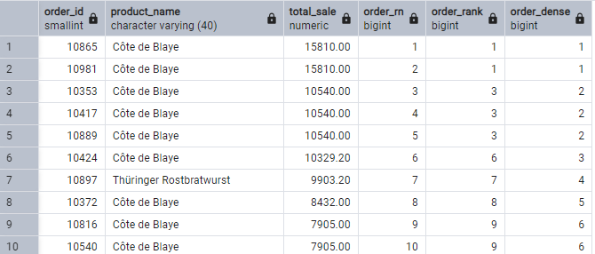
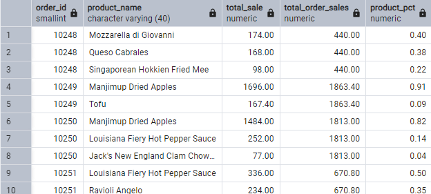

# 04 | Window Functions <!-- omit from toc -->


- [Introduction](#introduction)
- [Goals](#goals)
- [What have we seen so far?](#what-have-we-seen-so-far)
- [The Window Functions](#the-window-functions)
	- [Understanding the concept](#understanding-the-concept)
- [`MIN()`, `MAX()`, `AVG()`](#min-max-avg)
	- [Using `GROUP BY`](#using-group-by)
	- [Using `WINDOW FUNCTIONS`](#using-window-functions)
	- [Window functions main features:](#window-functions-main-features)
- [Collapse](#collapse)
	- [Example without `GROUP BY`](#example-without-group-by)
	- [Example with `GROUP BY`](#example-with-group-by)
	- [Why it "collapses" the rows:](#why-it-collapses-the-rows)
- [Limitations of `SELECT` WITH `GROUP BY`](#limitations-of-select-with-group-by)
	- [`WINDOW FUNCTIONS` as workaround](#window-functions-as-workaround)
	- [The advantages of using Window Functions](#the-advantages-of-using-window-functions)
- [`RANK()`, `DENSE_RANK()` and `ROW_NUMBER()`](#rank-dense_rank-and-row_number)
	- [Example: Classifying the products with highest sales by `order_id`](#example-classifying-the-products-with-highest-sales-by-order_id)
		- [Similar query using `SUB QUERY`](#similar-query-using-sub-query)
		- [Finding the cumulative proportion of products for each sale](#finding-the-cumulative-proportion-of-products-for-each-sale)

# Introduction
In this second lesson, we focused on JOIN operations.

# Goals
Our main goals were:
- Understand how each JOIN operation works
- Underline the importance of paying attention to the **question** that is asked and how it affects the type of `JOIN` we need to use
- Consider the importance of normalization in today's data environment vis-a-vis costs.
- Understand how `HAVING` works.

# What have we seen so far?
With `GROUPBY`, we have seen that we can get two outputs:
- One with all lines (with or without a filter using the `WHERE` clause).
- Another with grouped lines by a number of dimnesions using `GROUP BY`.

For instance, let us try to find:
- The number of orders per `order_id`
- The number of units sold per `order_id`
- The total price per `order_id`

```SQL
SELECT
	order_id,
	COUNT(order_id) AS unique_product,
	SUM(quantity) AS total_quantity,
	ROUND(CAST(SUM(unit_price * quantity)AS NUMERIC),2) AS total_price
FROM order_details o
GROUP BY order_id
ORDER BY order_id;
```

Yet what if we wanted to group the data by some sort of rule and return the aggregated value at the **row** level? What if we don't want to aggregate our data and obtain values within a window frame? We can achieve that with...

# The Window Functions
## Understanding the concept
We use window functions when we don't want to change the number of observations in our dataset; that is, we don't want to aggregate it. We can think about it as creating a new column at the row level.

The `window functions` allow us to perform efficient and precise analyses within specific **partitions or rows**. These are crucial when we want to run tasks such as classifying, aggregating and analyzing trends in a SQL query.
These functiones are applied to each **row** of a set of results. We use the `OVER()` clause to determine how each row is processed within a window, allowing us to control how a function is expected to behave within a determined group of ordered data.

Here follows an example of its syntax and components:
```SQL
window_function_name(arg1, arg2,...) OVER(
	[PARTITION BY partition_expression, ...]
	[ORDER BY sort_expression [ASC | DESC], ...]
)
```
Let's take a look at each of these components:
- `window_function_name`: This is the name of the window function that we wish to apply.
  - Examples: `SUM()`, `RANK()`, `LEAD()`
  - `arg1`, `arg2`, ...: These are the **arguments** that we pass to the window function if it requires any.
    - For example, when using `SUM()`, you would need to specify the **target column** that would be used to perform the calculation.
  - `OVER`: This is the **main concept of window functions**. It creates the "window" on which our calculations are performed.
  - `PARTITION BY`: This clause dovodes the set of results into **partitions or groups**. The window function operates independently within each partition.
  - `ORDER BY`: This **optional** clause specifies the **order** by which each row will be processed within every partition. You can specify it as **ascending** (`ASC`) or **descending** (`DESC`).
  
  We can take a look at a typical SQL query with a window function.

```SQL
SELECT 
	DISTINCT order_id,
	COUNT(product_id) OVER (PARTITION BY order_id) AS unique_product, -- count the number of products partitioned by order_id
	SUM(quantity) OVER (PARTITION BY order_id) AS total_quantity, -- sum the total quantity for each order_id
	SUM(unit_price * quantity) OVER (PARTITION BY order_id) AS total_price -- multiply unit price times quantity, sum it for each order_id
FROM order_details o
ORDER BY order_id;
```

What is going on here? Let's break it down:
```SQL
DISTINCT order_id,
```
- We first get the distinct values for `order_id` - this part will return one id per row.

```SQL
	COUNT(product_id) OVER (PARTITION BY order_id) AS unique_product, -- count the number of products partitioned by order_id
```
- Here, we are counting the number of `product_id` for each `order_id`. We partitoned our table using `order_id`.


```SQL
	SUM(quantity) OVER (PARTITION BY order_id) AS total_quantity, -- sum the total quantity for each order_id
```
- Now, we get the sum of `quantity`, partitioned by `order_id`. As a result, we expect to get the total quantity ordered for each `order_id`.

```SQL
	SUM(unit_price * quantity) OVER (PARTITION BY order_id) AS total_price -- multiply unit price times quantity, sum it for each order_id
```
- Finally, we multiply each `unit_price` by `quantity` at a row level. We then sum this calculation, partitioning it by `order_id`. That is, we expect to get the total price for each `order_id`.

We then use `ORDER BY` to order our query ascendingly using `ORDER BY order_id`.


# `MIN()`, `MAX()`, `AVG()`
What are the min, max and average freight values paid for each customer? We can answer this question using either `GROUP BY` or `WINDOW FUNCTIONS`:
## Using `GROUP BY`
Let's take a look at the following query:
```SQL
SELECT
	customer_id,
	MIN(freight) AS min_freight,
	MAX(freight) AS max_freight,
	ROUND(CAST(AVG(freight) AS numeric),2) AS avg_freight
FROM orders
GROUP BY customer_id
ORDER BY customer_id;
```
Here, we have done the following tasks:
- We queried the `customer_id`
- We used `MIN(freight)` to get the lowest freight value
- We used `MAX(freight)` to get the highest freight value
- We used `AVG(freight)` to get the average freight value
- We then pass `GROUP BY customer_id` so that our aggregations are done at the `customer_id` level.
- We order our query by `customer_id` ascendingly.

## Using `WINDOW FUNCTIONS`
Let's consider the following query:
```SQL
SELECT
	DISTINCT customer_id,
	MIN(freight) OVER (PARTITION BY customer_id) AS min_freight,
	MAX(freight) OVER (PARTITION BY customer_id) AS max_freight,
	ROUND(CAST(AVG(freight) OVER (PARTITION BY customer_id) AS numeric),2) AS avg_freight
FROM orders
ORDER BY customer_id;
```
- We queried the distinct values for `customer_id`, returning only unique values.
- We used `MIN(freight)` to get the lowest freight value and `PARTITION BY customer_id` to calculate the lowest freight value for each group of observations that have the same `customer_id` 
- We used `MAX(freight)` to get the highest freight value and `PARTITION BY customer_id` to calculate the highest freight value for each group of observations that have the same `customer_id`
- We used `AVG(freight)` to get the average freight value and `PARTITION BY customer_id` to calculate the average freight value for each group of observations that have the same `customer_id` 
- We order our query by `customer_id` ascendingly.
## Window functions main features:
- **Window Functions** (`OVER`): The window functions allow us to execute calculations on a set of rows that are related to each data entry.
  - Example: when using `PARTITION BY customer_id`, the window function starts again for each new `customer_id`. This means that each `MIN()`, `MAX()`, and `AVG()` calculation is confined within each set of orders for each customer individually.
  - `DISTINCT`: This clause is applied so that we get one row for each `customer_id`; without it, we could get duplicates, as each `customer_id` could appear multiple times if there were more than one order per client.

# Collapse
To understand how the `GROUP BY` clause can influence the results of a SQL query and why it can "collapse" rows, we can use an example based on the three aggregations that we have just discussed.

## Example without `GROUP BY`
Let us consider the following query without using `GROUP BY`.

```SQL
-- 830 rows
SELECT
	customer_id,
	freight
FROM orders;
```

## Example with `GROUP BY`

Let's bring back our previous example using `GROUP BY`.
```SQL
-- 89 rows
SELECT
	customer_id,
	MIN(freight) AS min_freight,
	MAX(freight) AS max_freight,
	ROUND(CAST(AVG(freight) AS numeric),2) AS avg_freight
FROM orders
GROUP BY customer_id
ORDER BY customer_id;
```

What did just happen? Let's review:
- `GROUP BY customer_id`: aggregates all entries in the table `orders` that share the same `customer_id`. For each grouped id, the query calculates the min, max, and average freight prices.
-  **Aggregations** (`MIN`, `MAX`, `AVG`): Each of these aggregate functions operate on the set of `freight` within each value from `customer_id`. For each group, we get a single aggregate result.

## Why it "collapses" the rows:
- When we use `GROUP BY`, the query returns a single row for each group of `customer_id`, where each row contains the `customer_id` and the aggregated `freight` values for this group. This means that if a customer has several orders, you won't get to see each order **individually**; instead, we will get a row of summary freight statistics for every orders from this particular client.

# Limitations of `SELECT` WITH `GROUP BY`
If we try to select a column that is **not** included in the `GROUP BY` clause and that is not an aggregate expression, the query will **fail**. For instance, the following query will result in an error because `order_date` is not aggregated using any function nor is part of the `GROUP BY` clause.

```SQL
SELECT
	customer_id,
	order_date,
	AVG(freight) AS avg_freight
FROM orders
GROUP BY customer_id;
```

## `WINDOW FUNCTIONS` as workaround
We can avoid the "collapse" effect using window functions. Let's take a look at the following query.
```SQL
SELECT
	customer_id,
	order_id,
	freight,
	MIN(freight) OVER (PARTITION BY customer_id) AS min_freight,
	MAX(freight) OVER (PARTITION BY customer_id) AS max_freight,
	AVG(freight) OVER (PARTITION BY customer_id) AS avg_freight
FROM orders
ORDER BY customer_id, order_id;
```
- **Selecting columns**: We selected `customer_id`, `order_id`, and `freight` directly, maintaining each individual order row visible in our result.
- **Window functions**: `MIN(freight) OVER`, `MAX(freight) OVER`, and `AVG(freight) OVER` are applied using the `PARTITION BY customer_id` clause. This means that the freight statistics will be calculated for each group of `customer_id`. However, because we did not pass `DISTINCT` to our columns, we get more than one row for each `customer_id`.
- **`PARTITION BY customer_id**: Guarantees that the window functions are recalculated for each customer. Each order maintains its row, but now it also includes the fright aggregates for the client to which the order belongs.
- **`ORDER BY customer_id, order_id`**: Sorts the orders first by `customer_id`, then by `order_id`. 

## The advantages of using Window Functions
- **Detailed data is preserved**: Differently from `GROUP BY`, the window functions return aggregations at the same row level. This is a useful feature when one wants to see both individual and aggregated data values.
- **Flexibility**: You can calculate multiple aggregate metrics using different partitions within the same query without multiple queries or complex subqueries.

# `RANK()`, `DENSE_RANK()` and `ROW_NUMBER()`
Let's take a look at the differences between these three ways of assigning values to rows as window functions:
- **`RANK()`**: Assigns an unique rank for each row. In case of a tie, it will apply the **same rank** to values which match and **leave a gap** where the following rank value would be. As such, when the rank increments, it always matches the number of rows corresponding to that rank.
- **`DENSE_RANK()`**: Assigns an unique rank for each row, with **continuous** values for tied rows. In contrast with `RANK()`, however, it will not skip any position in this scenario. We can have two matching values that receive rank 2, yet the next ranked value will receive rank 3 even if it is in the fourth row. As a result, the rank value does not coincide with the number of rows.
- **`ROW_NUMBER()`**: Assigns an unique sequential integer value to each line **indepentently from ties**, leaving no gaps.

## Example: Classifying the products with highest sales by `order_id`
The following query will give us different answers to this question.
```SQL
SELECT
	o.order_id,
	p.product_name,
	ROUND(CAST((o.unit_price * o.quantity) AS numeric),2) AS total_sale,
	ROW_NUMBER() OVER(ORDER BY (ROUND(CAST((o.unit_price * o.quantity) AS numeric),2)) DESC) as order_rn,
	RANK() OVER(ORDER BY (ROUND(CAST((o.unit_price * o.quantity) AS numeric),2))DESC) AS order_rank,
	DENSE_RANK() OVER(ORDER BY (ROUND(CAST((o.unit_price * o.quantity) AS numeric),2))DESC) AS order_dense
FROM order_details o
JOIN products p
	ON p.product_id = o.product_id;
```
Let's take a look at the ouput:


As we can see, we have three diferent outcomes:
- **`ROW_NUMBER()`**: Attributed a sequential number to each row based on `total_sale`, ordered from the highest to the lowest value. Each rows gets an unique value within the set of the entire results.
- **`RANK()`**: Attributed a rank to each row also based on `total_sale` descendingly. In case of tied values, however, it assigned the same rank to rows, skipping the next rank (there was no row with rank 2), reflecting the identity between row number and rank.
- **`DENSE_RANK()`**: Similarly to `RANK()`, it assigned the same rank to tied values without leaving rank gaps.

### Similar query using `SUB QUERY`
```SQL
SELECT
	sales.product_name,
	sales.total_sale,
	ROW_NUMBER() OVER(ORDER BY  sales.total_sale DESC) AS order_rn,
	RANK() OVER(ORDER BY sales.total_sale DESC) AS order_rank,
	DENSE_RANK() OVER(ORDER BY sales.total_sale DESC) AS order_dense
FROM (
	SELECT
		p.product_name,
		SUM(o.unit_price * o.quantity) AS total_sale
	FROM
		order_details o
	JOIN products p
		ON p.product_id = o.product_id
	GROUP BY p.product_name
) AS sales;
```
In this case, we create a subquery that fetches the sum of sales for each product, returning the results grouped by `product_name`. As we are not looking for total sales for each order, the result will return the rank of sales only for product, as we are applying our window functions to `total_sale` grouped by `product_name`.

### Finding the cumulative proportion of products for each sale
What if we wanted to know the percentages that each product represent to each sale? There could be easier ways to find it out, but I came up with this soluton:
```SQL
SELECT
	o.order_id,
	p.product_name,
	ROUND(CAST((o.unit_price * o.quantity) AS numeric),2) AS total_sale,
	SUM(ROUND(CAST((o.unit_price * o.quantity) AS numeric),2)) OVER (PARTITION BY o.order_id) AS total_order_sales,
	ROUND(ROUND(CAST((o.unit_price * o.quantity)AS numeric),2)/SUM(ROUND(CAST((o.unit_price * o.quantity) AS numeric),2)) OVER (PARTITION BY o.order_id),2) AS product_pct
FROM order_details o
JOIN products p	
	ON p.product_id = o.product_id
ORDER BY o.order_id, product_pct DESC;
```
Comments:
- We get the total sales for each `order_id` using `PARTITION BY order_id`. 
- Then, we calculate the total_sale at the row level without any aggregation and divide it by `total_sale`, which only considers `order_id`.
-  The rest is just formatting so that we get a two decimals value.
-  Output:


